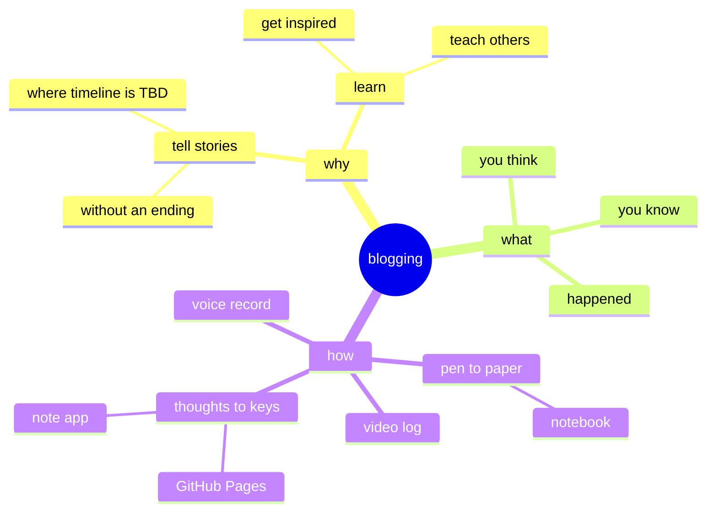

# Why Blogging Matters: Share Your Voice, Build Connection, and Grow Along the Way

In today’s digital world, blogging remains one of the most powerful tools for sharing your ideas, connecting with others, and even discovering more about yourself. Whether you're writing for personal fulfillment, professional growth, or to build a community, blogging offers a platform for creativity, reflection, and influence.  

You don’t need to be a professional writer or an expert in your field to start a blog. What matters is your willingness to share your voice and engage in the process of growth—one post at a time.  

---

## The Power of Blogging

Blogging is more than just writing; it’s a way to:  

- **Express Yourself:** A blog is your canvas for creativity. It’s a space to share your thoughts, stories, and passions in your unique voice.  
- **Connect with Others:** Blogs are bridges to like-minded readers. Your words can inspire, inform, and foster meaningful connections across the globe.  
- **Build Authority:** Sharing your expertise through blogging establishes you as a trusted voice in your niche. Over time, your blog can grow into a valuable resource for others.  
- **Reflect and Learn:** Blogging encourages you to think deeply, organize your thoughts, and refine your understanding of a topic.  

---

## Why You Should Start Blogging

If you’ve ever thought about starting a blog, here are some compelling reasons to take the leap:  

### 1. Find Your Voice  
Blogging helps you clarify your ideas and refine your communication skills. As you write, you’ll discover your unique style and perspective.  

### 2. Create a Legacy  
Your blog becomes a record of your thoughts, experiences, and growth. It’s something you can look back on and share with others for years to come.  

### 3. Inspire and Help Others  
Your insights and experiences could be exactly what someone else needs to hear. Blogging allows you to make a positive impact by sharing what you’ve learned.  

### 4. Grow Your Skills  
Blogging isn’t just about writing; it also involves researching, storytelling, and even basic design or SEO skills. Each post is an opportunity to grow.  

### 5. Explore Opportunities  
Blogs can open unexpected doors, from networking opportunities to collaborations, speaking engagements, or even monetization through ads, sponsorships, or products.  

---

## Getting Started: How to Begin Blogging

Starting a blog may feel overwhelming, but it doesn’t have to be. Follow these simple steps to get started:  

### 1. Choose Your Purpose  
Why do you want to blog? Whether it’s to share personal stories, build a professional brand, or explore a passion, knowing your “why” gives your blog direction.  

### 2. Pick a Platform  
Popular platforms like GitHub Pages, WordPress, Blogger, or Wix make it easy to start blogging. Many offer free options, but investing in a domain and hosting gives your blog a professional edge.  

### 3. Find Your Niche  
Write about what excites you. Your enthusiasm will shine through and attract readers who share your interests.  

### 4. Start Small  
Don’t worry about creating the perfect blog. Focus on writing your first post. Over time, your blog will evolve as you gain confidence and experience.  

### 5. Be Consistent  
Set a realistic posting schedule and stick to it. Consistency builds trust with your audience and keeps you motivated.  

---

## Tips for Blogging Success

- **Write for Your Audience:** Consider who you’re writing for and what value your blog provides to them.  
- **Be Authentic:** Your unique perspective is your greatest strength. Don’t try to imitate others—be yourself.  
- **Engage with Readers:** Respond to comments, ask for feedback, and create a sense of community around your blog.  
- **Focus on Quality:** While frequency matters, prioritize thoughtful, well-written content over quantity.  
- **Keep Learning:** Blogging is a journey. Explore topics like SEO, content marketing, or web design to grow your blog’s reach and impact.  

---

## What I’ve Learned Through Blogging

Blogging has been a deeply rewarding journey for me. It’s taught me to embrace vulnerability, share my voice with confidence, and connect with incredible people from all walks of life. Each post has been a step in my growth, both as a writer and as a person.  

I’ve learned that blogging isn’t just about what you share—it’s about the connections you make, the lessons you learn, and the impact you leave behind.  

---

## Your Call to Action

If you’ve been thinking about starting a blog, there’s no better time than now. Don’t wait for the “perfect” topic, platform, or moment—just start. Write your first post, share your ideas, and let the journey unfold.  

Blogging is about more than creating content; it’s about sharing a piece of yourself and growing along the way. So, what’s stopping you? Start today, and let your blog be a reflection of your voice, your passions, and your story.  

Because the world needs your unique perspective—and it’s waiting for you to share it.
