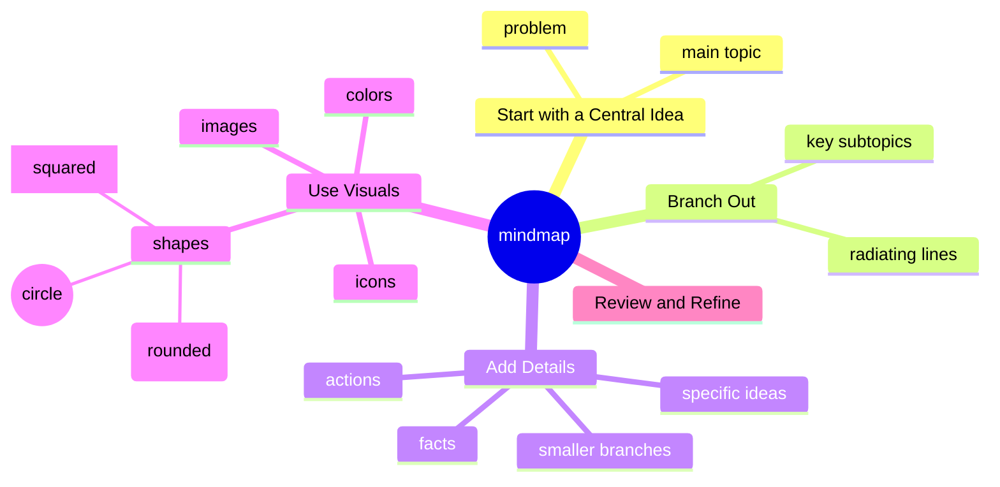

# Unlocking the Power of Mind Mapping

Have you ever felt overwhelmed by a swirl of ideas, tasks, or goals, unsure how to bring them into focus? You’re not alone. The human mind is a powerful tool, but it’s often at its best when supported by visual aids that help organize and clarify our thoughts. That’s where mind mapping comes in: a simple yet transformative technique for untangling complexity and sparking creativity.

## What Is Mind Mapping?

Mind mapping is a visual method of organizing information. Think of it as creating a map for your mind, where ideas, concepts, and connections branch out from a central topic. It’s more than just a diagram; it’s a way to harness your brain’s natural ability to think associatively.

The beauty of mind mapping lies in its flexibility. You can use it to brainstorm ideas, solve problems, plan projects, or even study complex topics. It’s a tool that adapts to your needs, whether you’re working through a business strategy, writing a book, or simply clarifying your thoughts.

## How to Create a Mind Map

1. Start with a Central Idea:
	> Write your main topic or problem in the center of a blank page (or a digital canvas). This is the anchor for all your thoughts.

2. Branch Out:
	> Draw lines radiating from the central idea and add key subtopics or categories. These could be questions, tasks, or related concepts.

3. Add Details:
	> From each subtopic, create smaller branches for specific ideas, facts, or actions. Continue expanding until your thoughts feel organized.

4. Use Visuals:
	> Enhance your mind map with colors, icons, or images to make it more engaging and easier to remember. The more visual, the better!

5. Review and Refine:
	> As your map evolves, step back and identify patterns, connections, or gaps. This is where insights often emerge.

## Why Mind Mapping Works

- Engages Both Sides of the Brain: Mind mapping combines logical structure with creative elements like colors and images, activating both hemispheres of your brain for deeper thinking.
- Boosts Memory and Understanding: The visual layout helps you see relationships and retain information more effectively than linear notes.
- Clarifies Complex Ideas: Breaking down big concepts into smaller, manageable parts makes problems feel less daunting.
- Encourages Creativity: The free-flowing nature of mind mapping allows unexpected connections to surface.

## Applications of Mind Mapping

Mind mapping is versatile and can be used for countless purposes. Here are just a few:
- Personal Growth: Organize your goals, map out life decisions, or track habits.
- Problem Solving: Break down challenges and brainstorm solutions systematically.
- Learning and Studying: Summarize lectures, books, or research for better comprehension.
- Work and Projects: Plan presentations, manage tasks, or outline reports.
- Creativity: Brainstorm story ideas, design innovative products, or outline blog posts like this one!

## Tools for Mind Mapping

You can start mind mapping with just pen and paper, but if you prefer digital tools, here are a few popular options:
- Mermaid: text to mindmap
- MindMeister: Great for collaborative mind mapping.
- XMind: Ideal for detailed, professional-grade maps.
- Coggle: Simple and intuitive for beginners.
- FreeMind: An open-source option with no frills.

## My Personal Journey with Mind Mapping

Mind mapping has been a game-changer for me. It’s helped me organize complex projects, clarify vague ideas, and even plan my next steps in life. Whenever I feel stuck or overwhelmed, a mind map is often the tool that gets me moving again. It’s not just a way to organize thoughts, it’s a way to discover new ones.

## Your Turn to Start Mapping

If you’ve never tried mind mapping before, now is the perfect time to start. Begin with a single idea or problem you’re facing today. Grab a blank sheet of paper (or open a digital tool) and see where your thoughts take you. You might be surprised by the clarity and inspiration that emerge.

Remember, mind mapping isn’t about creating a perfect diagram, it’s about making your thoughts visible and actionable. So let go of perfectionism, let your creativity flow, and unlock the power of your mind.
