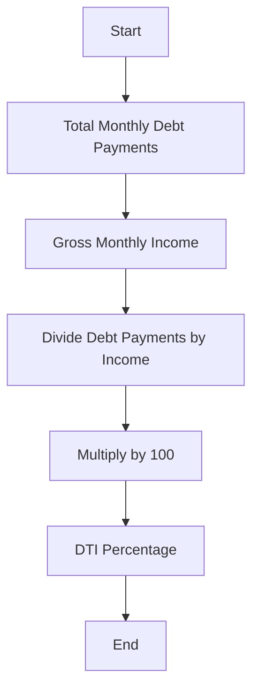

Here’s the assessment guide formatted as a GitHub-friendly markdown document:

# Assessing Your Financial Situation Regarding Mortgage Default

This guide will help you evaluate your financial standing, understand your options, and take informed steps to address a potential mortgage default.

---

## Table of Contents
1. [Review Your Financial Status](#1-review-your-financial-status)
2. [Calculate Your Debt-to-Income (DTI) Ratio](#2-calculate-your-debt-to-income-dti-ratio)
3. [Assess Your Savings and Emergency Fund](#3-assess-your-savings-and-emergency-fund)
4. [Understand the Details of Your Mortgage](#4-understand-the-details-of-your-mortgage)
5. [Identify Causes of Financial Strain](#5-identify-causes-of-financial-strain)
6. [Evaluate Your Options for Increasing Income](#6-evaluate-your-options-for-increasing-income)
7. [Prioritize Expenses](#7-prioritize-expenses)
8. [Consult a Professional](#8-consult-a-professional)
9. [Develop a Plan](#9-develop-a-plan)
10. [Take Action](#10-take-action)

---

## 1. Review Your Financial Status
- **Income:** Calculate your total monthly income from all sources (e.g., salary, rental income, investments).
- **Expenses:** List all monthly expenses, including essentials (e.g., groceries, utilities, transportation) and non-essentials (e.g., entertainment).
- **Debt Obligations:** Include all debt payments (credit cards, car loans, student loans, etc.), especially your mortgage payment.

**Tip:** Use a budgeting tool or app to organize and track your income and expenses.

---

## 2. Calculate Your Debt-to-Income (DTI) Ratio
The DTI ratio shows how much of your income goes toward debt payments

Resulting in this formula:
> DTI = (Total Monthly Debt Payments / Gross Monthly Income) x 100

** DTI **\
$$\text{DTI} = \left( \frac{\text{Total Monthly Debt Payments}}{\text{Gross Monthly Income}} \right) \times 100$$

- A DTI above **43%** is often a red flag for financial strain.
- If your mortgage payment alone exceeds **28%-31%** of your income, you may face challenges in sustaining payments.

---

## 3. Assess Your Savings and Emergency Fund
- Review your savings and liquid assets (e.g., cash, stocks).
- Determine how long your savings can cover essential expenses, including your mortgage.
- Ideally, have at least **3–6 months of living expenses** in an emergency fund.

---

## 4. Understand the Details of Your Mortgage
- **Monthly Payment Amount:** Includes principal, interest, taxes, and insurance (PITI).
- **Remaining Balance:** Know the total amount owed.
- **Interest Rate:** Higher rates can increase payments.
- **Loan Type:** Fixed-rate or adjustable-rate mortgages (ARMs) can affect payment stability.
- **Grace Periods and Penalties:** Review your loan agreement to understand late payment penalties or foreclosure timelines.

---

## 5. Identify Causes of Financial Strain
Determine the reasons for mortgage default, such as:
- Loss of income (e.g., job loss, reduced hours).
- Increased expenses (e.g., medical bills, unexpected repairs).
- Poor budgeting or financial mismanagement.

---

## 6. Evaluate Your Options for Increasing Income
- Take on part-time or freelance work.
- Sell unused items or assets.
- Explore government assistance or community resources.

---

## 7. Prioritize Expenses
- Focus on essential expenses first: housing, food, healthcare, and utilities.
- Reduce or eliminate discretionary spending (e.g., dining out, subscriptions).

---

## 8. Consult a Professional
- **Housing Counselor:** Contact a HUD-approved housing counselor for advice and assistance.
- **Financial Advisor:** Seek personalized strategies to improve your financial health.
- **Attorney:** If legal guidance is needed, consult an attorney to protect your rights.

---

## 9. Develop a Plan
Based on your assessment, create a plan to address your mortgage default. Options may include:
- Adjusting your budget to prioritize mortgage payments.
- Negotiating with your lender for:
  - Temporary forbearance.
  - Loan modification.
  - Repayment plans.
- Selling the property to avoid foreclosure (e.g., short sale).
- Filing for bankruptcy as a last resort (seek legal advice first).

---

## 10. Take Action
- Act promptly to avoid further penalties or foreclosure.
- Communicate with your lender as soon as possible to explore solutions.

---

## Conclusion
By thoroughly assessing your financial situation and exploring available resources, you can better understand your options and take steps to regain financial stability.

---

_Disclaimer: This document is for informational purposes only and does not constitute financial or legal advice. Consult a professional for personalized guidance._
